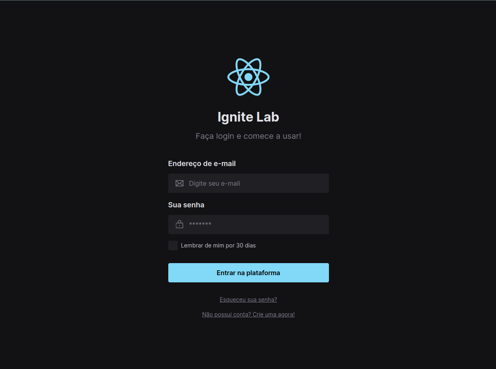

# ignite-lab-design-system

  Exemplo de Design System utilizando React e Tailwindcss

  

## ✨ Tecnologias

- [React](https://react.dev/)
- [Storybook](https://storybook.js.org/)
- [TypeScript](https://www.typescriptlang.org/)

## 📝 License

Esse projeto está sob a licença MIT. Veja o arquivo [LICENSE](LICENSE) para mais detalhes.

---

## Terminal Commands

1. Install NodeJs from [NodeJs Official Page](https://nodejs.org/en).
2. Open Terminal
3. Go to your file project
4. Run in terminal: `npm install`
5. And: `npm run start`

## To show storybook of components documentation

1. Run `npm run storybook`
